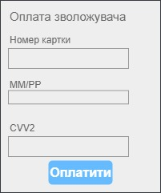
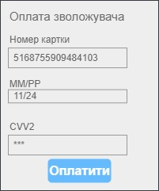
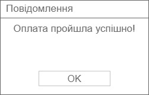

| NFR ID |  Test Case ID  | Опис кроків тестового сценарію | Опис очікуваних результатів |
|----| --------------------------------------- | ----------- | ------------------ |
|NFR1.1| TC1.7 |Початкові умови: відсутні  Кроки сценарію: відсутні  |  |
|NFR1.1| TC1.8 |Початкові умови: успішно пройдено TC1.7  Кроки сценарію:1) в поле номер картки внесено 5168755909484103,  2) в поле ММ/РР внесено 1124 3) в поле CVV2 внесено 111, які позначені "*" |   |
|NFR1.1| TC1.9 |Початкові умови: успішно пройдено TC1.8  Кроки сценарію:1) натиснути кнопку "Оплатити"|   |